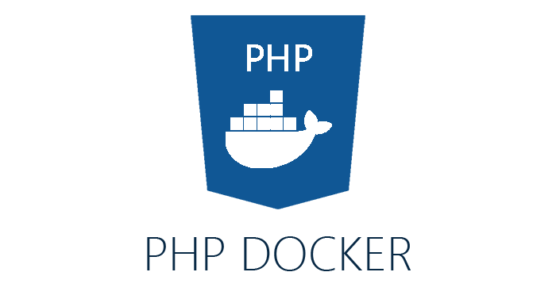

**PHP Docker** is a fast and stable development environment that uses Docker to create
a module to serve your PHP applications.

**Requirements**

- Docker
- Docker compose

**What's Inside**

- PHP 7.2.11
- Nginx 1.15
- MariaDB 10.3
- NodeJS 8
